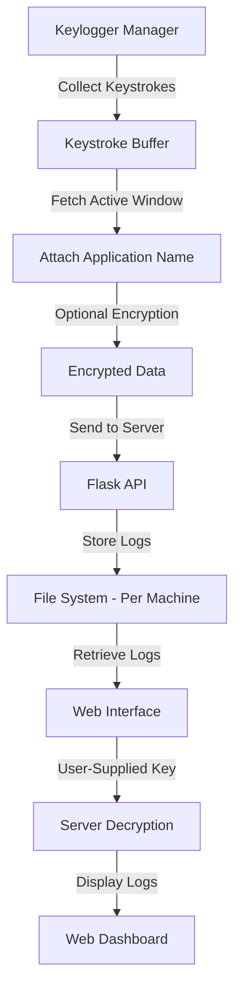

# Keylogger System

## Overview

This project is a modular **Keylogger System** designed to **capture keystrokes**, **encrypt logs**, and **store them
securely** in multiple formats. It includes a **Flask API** for log retrieval, **user authentication**, and a *
*web-based UI** for log management.

## Features

- **Keystroke Logging** – Captures user input from the keyboard.
- **Application Focus Logging** – Tracks which application was active during keystroke input.
- **Encryption Support** – Encrypts logs using **XOR Encryption** (can be extended for stronger methods).
- **Multiple Log Writers**:
    - **ConsoleLogWriter** – Displays logs in the console.
    - **FileLogWriter** – Stores logs in a `.txt` file.
    - **JsonLogWriter** – Saves logs in a structured JSON format.
    - **ServerLogWriter** – Sends logs to a **Flask API** for remote storage.
- **Configurable Log Interval** – Periodically processes and writes logs every **X seconds**.
- **Web-Based UI** – Displays captured logs with filtering, sorting, and searching.
- **User Authentication** – Simple password-based authentication ensures **only authorized users** can access logs.
- **User-Supplied Decryption** – Logs are **decrypted on the server** using a key provided by the user.
- **Thread-Safe Design** – Atomic operations ensure safe execution.
- **Flexible and Extensible** – Supports additional log writers, encryption mechanisms, and output destinations.

## System Architecture

The project is structured as follows:

```
keylogger_project/
│── keylogger/
│   ├── interfaces/
│   │   ├── EncryptorInterface.py   # Defines encryption methods
│   │   ├── KeyloggerInterface.py   # Defines keylogger behavior
│   │   ├── LogWriterInterface.py   # Defines logging behavior
│   ├── encryptors/
│   │   ├── XorEncryption.py        # Implements XOR encryption
│   ├── keyloggers/
│   │   ├── SimpleKeylogger.py      # Captures keystrokes
│   ├── logwriters/
│   │   ├── ConsoleLogWriter.py     # Writes logs to console
│   │   ├── FileLogWriter.py        # Writes logs to a text file
│   │   ├── JsonLogWriter.py        # Writes logs to JSON
│   │   ├── ServerLogWriter.py      # Sends logs to Flask API
│   ├── manager/
│   │   ├── KeyLoggerManager.py     # Collects, encrypts, and sends logs
│── server/
│   ├── app.py                      # Flask API for log retrieval and authentication
│   ├── data/                        # Stores encrypted logs per machine
│   ├── static/
│   │   ├── scripts/
│   │   │   ├── script.js            # Handles API requests and UI interactions
│   │   ├── styles/
│   │   │   ├── style.css            # Styling for the UI
│   ├── templates/
│   │   ├── index.html               # Main frontend interface
│── main.py                          # Initializes and runs the keylogger system
│── README.md                        # Project documentation
```

## Flowchart

Below is the **logical flow** of how the system operates:



## Installation & Setup

### Prerequisites

Ensure you have **Python 3.8+** installed and install required dependencies:

```bash
pip install -r requirements.txt
```

### Running the Keylogger

To start the keylogger agent:

```bash
python main.py
```

### Running the Flask Server

```bash
python server/app.py
```

### Accessing the Web UI

Navigate to the **URL where the Flask server is running**. By default, if running locally, access:

```
http://127.0.0.1:5000/
```

The web dashboard allows users to:

- View keystrokes per machine.
- Filter by **date, active window, or specific text**.
- Sort the data by **timestamp, window, or keystrokes**.
- Provide a **decryption key** to retrieve logs in plain text.

## Authentication & Log Retrieval

### **Login System**

Before accessing logs, users must **log in** using a simple password-based authentication system. If the correct
password is entered, access to logs is granted.

### **Fetching Keystrokes (With User-Supplied Decryption Key)**

To retrieve logs, the user must **provide a decryption key** via the web UI or API.

#### **API Endpoint:**

```http
GET /api/get_keystrokes?machine=computer1&key=my_secret_key
```

#### **Example Response:**

```json
{
  "machine": "computer1",
  "logs": {
    "2025-02-26 14:05:01": {
      "VS Code": "Hello World"
    },
    "2025-02-26 14:10:30": {
      "Chrome": "Google Search: Flask API"
    }
  }
}
```

## How It Works

1. `KeyLoggerManager` starts and initializes components.
2. `SimpleKeylogger` captures **keystrokes** and **active application**.
3. Logs are **encrypted** before being sent to the Flask API.
4. The server **stores logs per machine**.
5. Users retrieve logs via the **web interface**.
6. The **user provides a decryption key**, which the server uses to decrypt and return plaintext logs.

## Future Enhancements

- **Stronger Encryption (AES, RSA)**
- **Cloud-Based Log Storage**
- **Real-Time Log Monitoring**
- **More User Roles & Access Controls** (JWT-based authentication for enhanced security)
- **Log Visualization (Graphs & Charts)**

---
**Disclaimer:** This tool is for educational and security research purposes only. Unauthorized usage may violate privacy
laws.

